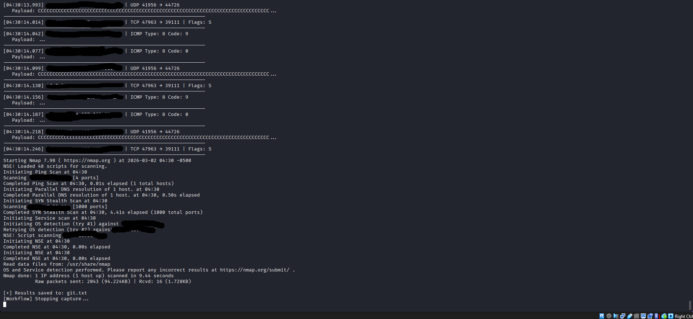
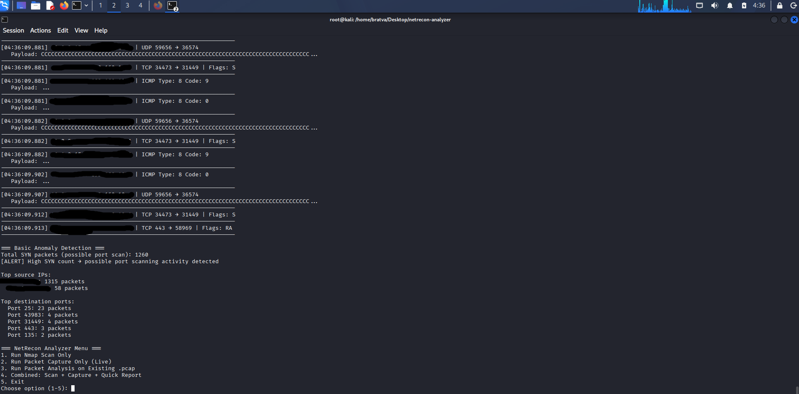

# NetRecon Analyzer 🛡️

[</image-card>](https://www.python.org/)
[</image-card>](https://opensource.org/licenses/MIT)
**A Python-based ethical network reconnaissance and packet analysis toolkit**

Combines **Nmap** port scanning with **Scapy** packet capture & analysis.

Built as a portfolio project by **anie** (Abuja, Nigeria) – March 2026  
Goal: Demonstrate practical cybersecurity skills (recon, traffic analysis, ethical considerations)

### Features
- Safe Nmap wrapper (SYN, TCP Connect, UDP, version/OS detection)
- Live & offline packet sniffing with protocol/payload display
- Combined workflow: Scan → Capture traffic → Analyze + basic anomaly detection
- CLI menu for easy use
- Results saved to files (.txt & .pcap)

### ⚠️ Legal & Ethical Warning
**This tool is for educational and authorized lab use ONLY.**  
Unauthorized scanning is illegal (Nigeria Cybercrimes Act 2015, international laws).  
Use exclusively in isolated environments you own/control:
- Kali Linux VM + Metasploitable VM
- VirtualBox/VMware lab
- TryHackMe / HackTheBox rooms

I am not responsible for any misuse.

### Demo Screenshots

** Main Menu with Instructions **
</image-card>

**Nmap Open Ports Output**  
</image-card>

**Packet Analysis Showing SYN Packets**  
</image-card>

**Anomaly Detection Alert Example**  
</image-card>

**Open Ports Visualization**  
The tool now generates a simple bar chart of detected open ports/services using Matplotlib.


### Installation
```bash
# Clone repo
git clone https://github.com/bratva-akin/netrecon-analyzer.git
cd netrecon-analyzer

# Install dependencies
pip install scapy pandas matplotlib
sudo apt update && sudo apt install nmap -y
